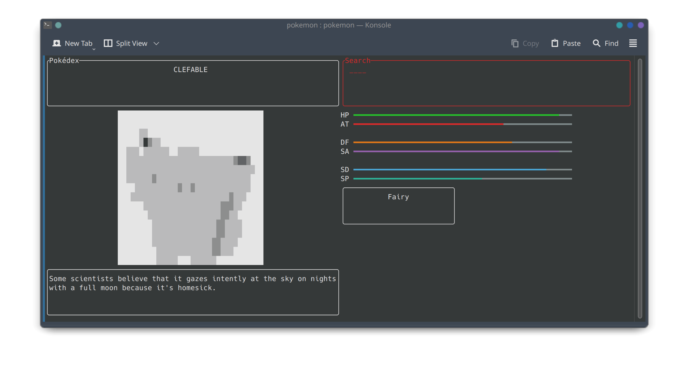
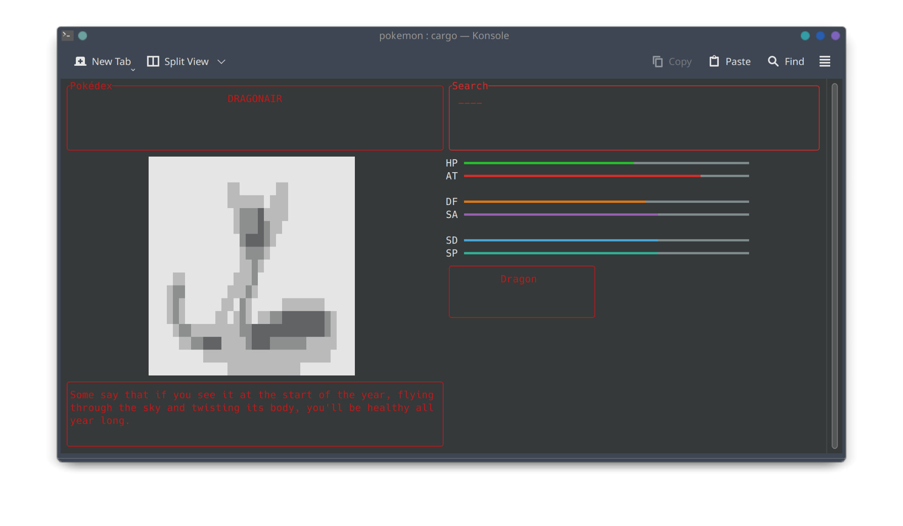
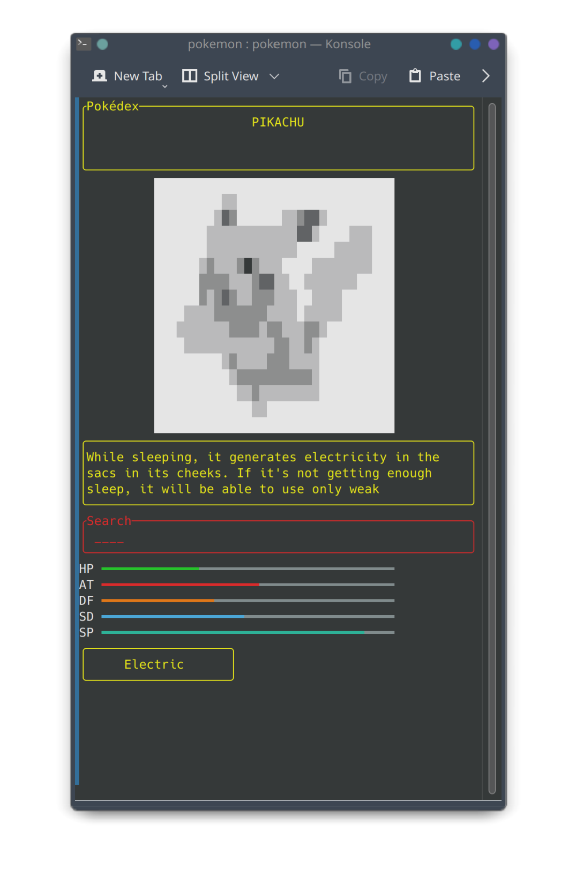

# Muk

Minimalist, unnecessary, and yet another pokédex,
but this time in your favourite terminal! and written completely in Rust!
(and I make way too many terminal apps!)

---

## Features
1. Works in the terminal (duh)
2. Responsive design, will switch from vertical to horizontal view depending on the terminal size
3. Dynamic graphics, will scale with the window size





## Usage

**Bash**
```bash
git clone https://github.com/AnarchistHoneybun/Muk.git
cd Muk
cargo run 
```
after that, just type in the index of any generation 1 pokémon
and you're golden!




<details>
  <summary><i>Dependencies</i></summary>
  <ul>
    <li><a href="https://www.rust-lang.org/">rust</a></li>
    <li><a href="https://doc.rust-lang.org/cargo/">cargo</a></li>
    <li><a href="https://git-scm.com/">git</a></li>
  </ul>
</details>
